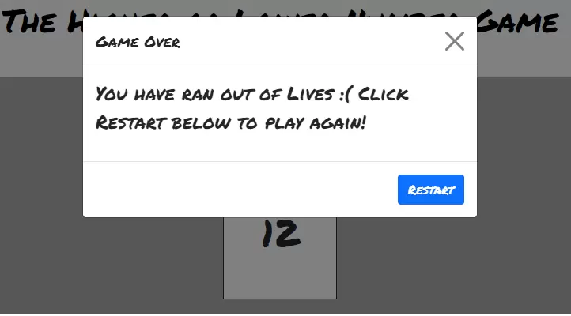

# Hi-Lo Number Game

## Live Link - https://nsc15.github.io/hi-lo-number-game/

## Background

The Hi-Lo Number game is my Milestone Two JavaScript Project. I have used HTML / CSS and Javascript in the creation of this. The aim of the game is to achieve the highest score you can by correctly guessing if the following number is going to be Higher or Lower, based on a traditional arcade scenario. The user is able to choose from three difficulty settings which each have different characteristics, for example Easy mode you have five lives to start with but Hard mode you will only have three. Upon losing all your lives, the game will then give you the option to restart.

## User Experience (UX)

## Design

### Colour Scheme

- This project's main colour scheme consists of Green (To emulate an arcade board game feeling)
- Grey / White and Black for the plain and effective constrast.

### Font

- Source = Google Fonts

- I have used the font 'Permanent Marker' with a back up of Sans-Serif for this game. The bold and stylish aesthetics of this font work brilliantly with the game design.

### Layout of the Game

### The landing page of the game - Awaiting User choosing a difficulty 

- 

### The games instructions modal, accessable through the blue question mark button 

- 

### The user has now chosen a difficulty and been assigned lives, score set to 0, number generated and Higher or Lower control buttons are now visible 

- 

### The action of the game, lives and score updated depending on user performance

- 

### The game over modal with the Restart button to replay the game 

- 

### WireFrames

- As evident through the wireframe, the design for this game is one of simplicity, with the clear focal point being the game controls (Higher or Lower Buttons) and the random number placeholder box. I have chosen the green background in an attempt to emulate an old school arcade board game feel.

## Features

- Responsive to 320px
- Custom CSS / HTML
- Custom Javascript front end DOM manipulation
- Custom Javascript back end functions
- Scoring System
- Game over feedback

## Functions

- HighScore (Global) - An Array (highScores) is accessible through local storage and the highScoreDisplay is then called within the HighScore modal when the user clicks the HighScores button. The actual highscore data addition is handled with the gameOver function however the array is handled globally by sorting into numerical order (highest - lowest). If the array is empty the DOM manipulates the span with the modal to say There is no high scores logged, however once there is scores to work with the highest is then displayed for the user to see, which will be stored until a deletion of the local storage.

- DOMContentLoaded Initial Function - This function is assigning variables gameDifficulty and userAnswers to the buttons classes of the difficulty buttons and the higher or lower buttons. Alongside this the Higher or Lower buttons visibility is hidden while a difficulty isnt chosen. Once a difficulty is clicked, this then runs the difficultyChoice function.

- higherorLowerInput - This function is determining which game function to run based on the user guessing Higher or Lower. If user clicked higher then runGame with the Higher result to give a comparison argument to further functions to determine if the user is correct or incorrect.

- difficultyChoice - Function grabs the lives data from the data array dependant which difficulty is chosen and assigns this to the users lives value. It also sets the difficulty buttons visibility to hidden once a difficulty is chosen and then displays text which tells the user "You are playing difficulty ...". Finally, this function also sets the users score to 0 in readiness to playing the game.

- randomNum - This function returns a number between 1 and then the max number property of whichever difficulty is chosen for example... Easy will generate a number between 1 and 10.

- runGame - This is the main body of the game to determine if the users answer is correct and then feedback with either an incrementation of 1 to the score if the answer is correct or by decreasing the lives by 1 if the users answer is incorrect. Due to 2 random numbers being generated for the game, there is a chance that these numbers are going to be equal so the original if statement is extended to say if both numbers are equal the score and lives in unaffected and advises the user to click to continue to re-generate numbers. Finally, once the lives get down to 0 the runGame function then calls the gameOver function.

- gameOver - This function essentially calls the gameOver modal onto the display to prompt the user that the game is over and to click the restart button to restart, which in turn calls the gameRestart function. This function also pushes the end score to the highScores array for storage into the local storage.

- gameRestart - This function utilises the location.reload tool, to bring the game back to the start and require the user to pick their difficulty setting then replay.

## Future Improvements

- Username creation and scores log

- Multiplayer options

## Technologies

- HTML - Used for the games main structure.
- CSS - Used for the games styling.
- Bootstrap - Grid system for structure, preset modal class for instructions and game over modals.
- Google Fonts - Provider of Permanent Marker font.
- Javascript - Used for Front end DOM Maniupulation and the games main back end functions.
- Balsamiq WireFrames - Project planning tool for visual design.
- Github - Gitpod store and deployment utility
- Gitpod - Project IDE
- Git - Version Control which passes data through to Github for storing and deploying as finished project.

## Testing & Validation

- W3C HTML Validator - HTML code validated with no errors.
- W3C Jigsaw CSS Validator - CSS code validated with no errors.
- JSHint - Javascript code validated with no errors.
- Dev Tools - Initial code tested through console via console logging output of functions first, also used for testing responsiveness.
- Devices - Different sizes devices used to test responsiveness.

## Bugs 

- As evident through the commit history, the initial coding strategy to get to my desired output was long-winded and over complicated - Key mentor sessions to re-write code in a more efficient way with same desired output. For example using an Array with each level with the lives and the max number assigned to them which can be accessed within further functions.  

## Credits 

- Reuben Ferrante - CI Mentor for code expertise and project planning
- Bootstrap - Use of Grid System and Modals
- Google Fonts - Permanent Marker Font
- Slack Community - In particular Dave Horrocks for answering any issues along the way to completing the project.