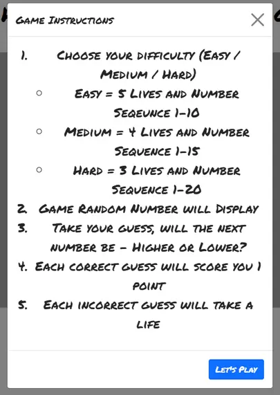

# Hi-Lo Number Game

## Live Link - https://nsc15.github.io/hi-lo-number-game/

## Background

The Hi-Lo Number game is my Milestone Two JavaScript Project. I have used HTML / CSS and Javascript in the creation of this. The aim of the game is to achieve the highest score you can by correctly guessing if the following number is going to be Higher or Lower, based on a traditional arcade scenario. The user is able to choose from three difficulty settings which each have different characteristics, for example Easy mode you have five lives to start with but Hard mode you will only have three. Upon losing all your lives, the game will then give you the option to restart.

## User Experience (UX)

## Design

### Colour Scheme

- This project's main colour scheme consists of Green (To emulate an arcade board game feeling)
- Grey / White and Black for the plain and effective constrast.

### Font

- Source = Google Fonts

- I have used the font 'Permanent Marker' with a back up of Sans-Serif for this game. The bold and stylish aesthetics of this font work brilliantly with the game design.

### Layout of the Game

### The landing page of the game - Awaiting User choosing a difficulty 

- 

### The games instructions modal, accessable through the blue question mark button 

- 

### The user has now chosen a difficulty and been assigned lives, score set to 0, number generated and Higher or Lower control buttons are now visible 

- 

### The action of the game, lives and score updated depending on user performance

- 

### The game over modal with the Restart button to replay the game 

- 

### WireFrames

- As evident through the wireframe, the design for this game is one of simplicity, with the clear focal point being the game controls (Higher or Lower Buttons) and the random number placeholder box. I have chosen the green background in an attempt to emulate an old school arcade board game feel.

## Features

- Responsive to 320px
- Custom CSS / HTML
- Custom Javascript front end DOM manipulation
- Custom Javascript back end functions
- Scoring System
- Game over feedback

## Future Improvements

- Username creation and scores log

- Multiplayer options

## Technologies

- HTML - Used for the games main structure.
- CSS - Used for the games styling.
- Bootstrap - Grid system for structure, preset modal class for instructions and game over modals.
- Google Fonts - Provider of Permanent Marker font.
- Javascript - Used for Front end DOM Maniupulation and the games main back end functions.
- Balsamiq WireFrames - Project planning tool for visual design.
- Github - Gitpod store and deployment utility
- Gitpod - Project IDE
- Git - Version Control which passes data through to Github for storing and deploying as finished project.

## Testing & Validation

- W3C HTML Validator - HTML code validated with no errors.
- W3C Jigsaw CSS Validator - CSS code validated with no errors.
- JSHint - Javascript code validated with no errors.
- Dev Tools - Initial code tested through console via console logging output of functions first, also used for testing responsiveness.
- Devices - Different sizes devices used to test responsiveness.

## Bugs 

- As evident through the commit history, the initial coding strategy to get to my desired output was long-winded and over complicated - Key mentor sessions to re-write code in a more efficient way with same desired output. For example using an Array with each level with the lives and the max number assigned to them which can be accessed within further functions.  

## Credits 

- Reuben Ferrante - CI Mentor for code expertise and project planning
- Bootstrap - Use of Grid System and Modals
- Google Fonts - Permanent Marker Font
- Slack Community - In particular Dave Horrocks for answering any issues along the way to completing the project.